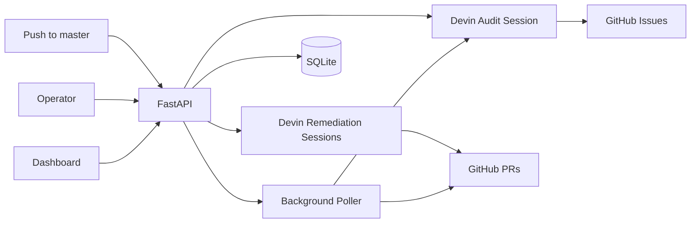

# Sentinel

- [Apache Superset](https://github.com/apache/superset) — upstream repository
- [superset-demo](https://github.com/dkuthoore/superset-demo) — fork used by this Sentinel deployment

Sentinel is a Devin-powered automated CVE identification and remediation tool for Apache Superset. Devin automatically checks the codebase for any known, patchable vulnerabilities (CVEs) when there is  any activity on the main/master branch, creates structured GitHub issues per CVE, dispatches Devin remediation agents, and tracks progress from audit to pull request in a live dashboard.


## Architecture




## What Devin Does

Sentinel uses Devin in two places:

- **Audit**: `POST /scan` or `POST /scan/devin` (or push-to-master poll) starts a Devin session that runs `pip-audit`, creates GitHub issues, and replies with `AUDIT_DONE: [...]`.
- **Remediation**: the poller dispatches one Devin session per CVE to upgrade the package, fix breakage, open a PR, and reply with `DONE: <PR_URL>`.

Structured sentinels (`AUDIT_DONE`, `DONE`, `BLOCKED`) make autonomous work observable and parseable.

## Project Structure

```text
sentinel/
├── dashboard/index.html          # No-build React dashboard
├── orchestrator/                 # FastAPI, clients, DB, polling, dispatch logic
├── tests/                        # Pytest with mocked Devin/GitHub clients
├── pyproject.toml
├── uv.lock
├── .env.example
├── Dockerfile
├── docker-compose.yml
└── README.md
```

## Prerequisites

- [Docker](https://docs.docker.com/get-docker/) and Docker Compose
- A fork of `apache/superset` on GitHub
- A Devin **service user** with `ManageOrgSessions` and `ViewOrgSessions`, connected to your fork
- A GitHub personal access token with access to your fork (issues and pull requests)

## Setup

```bash
cd sentinel
cp .env.example .env
```

Edit `.env` and set `DEVIN_API_KEY`, `DEVIN_ORG_ID`, `GITHUB_TOKEN`, and `GITHUB_REPO` (your `username/superset` fork).

Start Sentinel:

```bash
docker compose up --build
```

Dashboard: [http://localhost:8000](http://localhost:8000)

SQLite data persists in the `sentinel_data` Docker volume. To reset state: `docker compose down -v`.

Sentinel uses the [Devin v3 API](https://docs.devin.ai/api-reference/v3/overview).

### Required configuration

1. Fork `apache/superset` into your GitHub account.
2. Create a Devin service user with GitHub connected to that fork.
3. Create a GitHub token scoped for your fork (issues + PR metadata).
4. Enable branch protection on `master` in your fork (require PRs before merging).
5. Set `GITHUB_REPO` to `yourusername/superset`.

`GITHUB_TOKEN` lets Sentinel create/list issues and poll PR state. Devin needs its own GitHub access to edit the repository and open PRs.

### Push-to-master trigger

With `GITHUB_PUSH_POLL_ENABLED=1` (default), Sentinel polls your fork's default branch every `POLL_INTERVAL_SECONDS`. When the branch HEAD changes, it starts a Devin audit—the same flow as **Ask Devin To Audit**, without exposing a public URL.

**Demo:** edit `README.md` on your fork, commit, push to `master`, wait one poll interval (~5s), and watch the dashboard for a new audit session.

Set `GITHUB_DEFAULT_BRANCH` if your default branch is `main` instead of `master`.

### PR and merge detection

With `GITHUB_POLL_ENABLED=1` (default), the background poller checks GitHub for PRs linked to remediation issues and updates session status (`pr_opened`, `merged`) without requiring inbound HTTP callbacks.

## API Endpoints

- `POST /scan` — start Devin audit (alias for `/scan/devin`)
- `POST /scan/devin` — start Devin audit; poller dispatches remediation after `AUDIT_DONE`
- `POST /sessions/sync` — discover active Devin v3 sessions and upsert DB rows
- `GET /events` — Server-Sent Events for live dashboard updates
- `GET /sessions` — all audit and remediation sessions
- `GET /sessions/{id}` — one session
- `GET /metrics` — dashboard aggregates
- `GET /` — dashboard UI

## Local development

To run tests or hack on the orchestrator outside Docker:

```bash
cd sentinel
uv sync --extra dev
uv run pytest
uv run ruff check .
```

For a hot-reload API server: `uv run uvicorn orchestrator.main:app --reload`.

Tests use mocked Devin and GitHub clients (see `tests/fakes.py` and `tests/conftest.py`). No live API credentials are required to run the suite.

